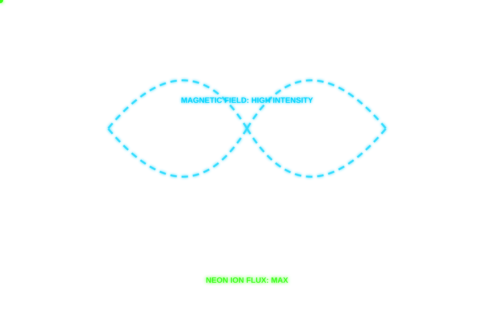

# WebGPU - Edge-AI-APP

## ⚡ Electron & Magnetic Field Demo

Interactive simulation showing electrons orbiting under a magnetic field, rendered over the WebGPU pipeline visualization.

> Electrons circulating through the WebGPU buffer initialization and data loading pipeline under an applied magnetic field (B-field).

### Simulation Parameters

| Parameter | Value |
|-----------|-------|
| Electrons | 60 |
| B-Field | ~0.5 T |
| Avg Velocity | ~0.12 c |
| Status | ACTIVE |

### Files

| File | Description |
|------|-------------|
| `electron-demo.html` | Interactive electron & magnetic field simulation |
| `webgpu-interactive.svg` | Animated SVG overlaying the original background |
| `webgpu-bg.jpg` | Original WebGPU pipeline background image |
| `index.html` | Edge-AI-APP Dashboard 3D |
| `*.wgsl` | WebGPU shader files |
| `*.asm` | Assembly circuit files |
| `*.js` | JavaScript modules |

### How to Run

Open `electron-demo.html` locally in your browser to see the interactive demo with electrons circulating and magnetic field lines.
